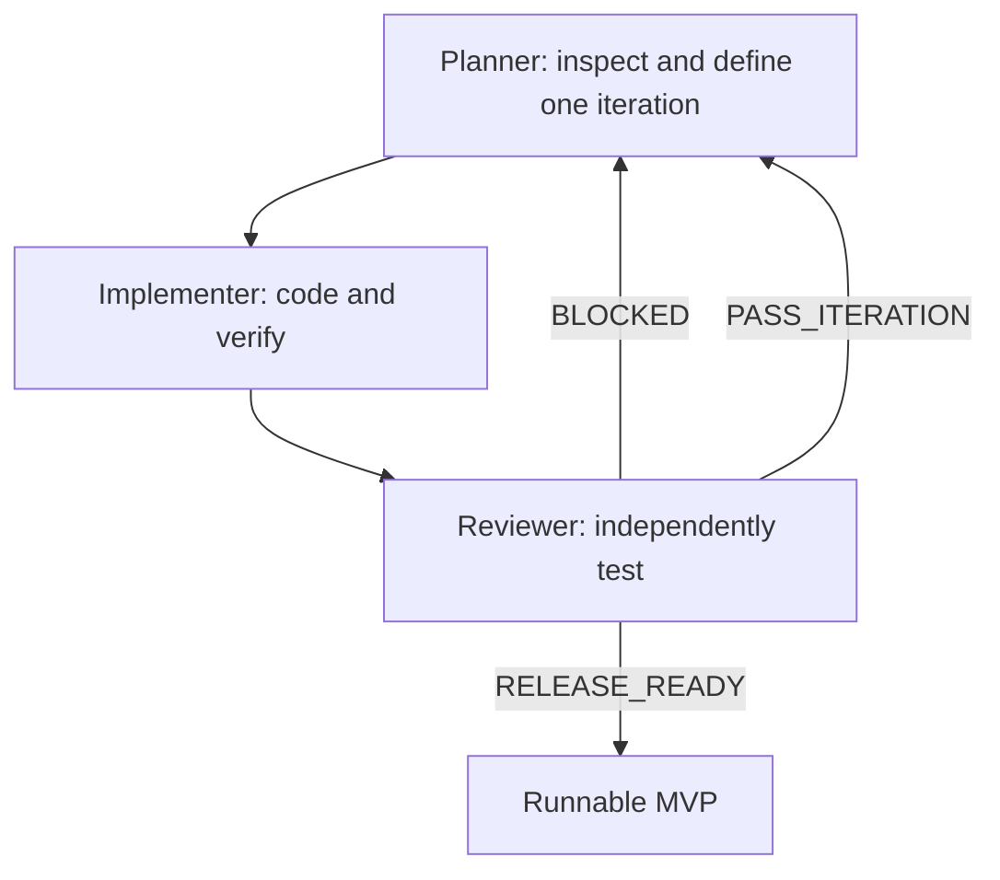

# CareWindow MVP Gap-Closure Requirements

## Planner → Implementer → Reviewer Loop

Place this file at the repository root beside `CLAUDE.md`. The global
instructions in `CLAUDE.md` continue to govern engineering behavior. This file
defines the project-specific work required to turn contract v1.3.0 into a
complete, runnable hackathon MVP.

---

## 1. Mission

Finish CareWindow as a trustworthy dental-benefits decision assistant that:

1. Calculates benefits deterministically from verified plan rules.
2. Recommends clinically valid, lower-cost treatment and payment schedules.
3. Models plan-year reset and rollover accurately.
4. Gives the member understandable alternatives rather than one opaque answer.
5. Allows the member to change any recommendation, preserves the change, and
   clearly explains its financial, coverage, timing, and clinical implications.
6. Runs end to end in synthetic mode without external services or credentials.

AI must not calculate benefits, invent plan terms, determine clinical urgency,
or overwrite a member choice. It may extract candidate facts and explain an
already-computed result.

---

## 2. Scope

### Required for this MVP

- Existing Benefit Passport.
- Existing before-visit Visit Navigator.
- Existing after-visit Care Plan Optimizer.
- Deterministic DPPO adjudication.
- Plan-year reset and complete rollover behavior.
- Recommendation alternatives and user-selectable priorities.
- User locks, edits, manual plans, comparison, warnings, and re-optimization.
- Claim versus verified self-pay comparison.
- Funding allocation and month-by-month payment view.
- Evidence for every plan-derived statement and calculation.
- Multiple synthetic plan options in the registry, even if the main demo uses
  only one selected option.
- Golden calculation fixtures and independent release review.
- Complete local startup, test, typecheck, build, and browser demo path.

### Explicit non-goals

- Live appointment-availability integrations.
- Whisper, audio recording, transcription, or live OCR.
- Real carrier eligibility or claims integrations.
- Production authentication or real PHI.
- Full DHMO, indemnity, or discount-plan adjudication.
- Coordination of benefits.
- Medical/dental crossover.
- Family aggregate deductible calculations.
- Orthodontic installment adjudication.

Existing synthetic provider slots and text/card extraction may remain. The
agents must not expand scope into the non-goals while P0 requirements remain.

### Priority convention

Unless a requirement explicitly says optional or deferred, every requirement
in Sections 3–14 is **P0 for release**. A plan-comparison screen is optional;
loading and correctly resolving multiple synthetic plan options is P0.

---

## 3. Nonnegotiable architecture invariants

| ID | Requirement |
|---|---|
| ARCH-001 | All money uses integer cents or the existing safe money type. Never use binary floating-point currency. |
| ARCH-002 | Service date, claim/adjudication date, and member payment date remain separate concepts. |
| ARCH-003 | The benefit engine is the only component that calculates deductible, plan payment, annual maximum, rollover, balance billing, or member responsibility. |
| ARCH-004 | The optimizer calls the benefit engine; it never duplicates insurance formulas. |
| ARCH-005 | The frontend formats engine values but never computes or adjusts money, dates, coverage, warnings, or recommendation status. |
| ARCH-006 | Only `VERIFIED` plan rules affect definitive calculations. Missing/conflicting rules return a typed issue, never a typical/default value. |
| ARCH-007 | Every plan-derived result carries rule IDs and evidence references. Every member/provider/dentist fact carries source and timestamp/status. |
| ARCH-008 | Identical inputs produce identical ranked results and traces. |
| ARCH-009 | Synthetic and production data cannot be mixed. Synthetic mode is visibly labeled and requires no network calls. |
| ARCH-010 | Existing ports/domain boundaries are preserved unless the Planner documents why a contract change is necessary. |

---

## 4. Plan identity and network correction

### PLAN-001 — Exact plan resolution

Resolve a plan version using at least:

```text
carrier
employer/group
plan option
jurisdiction/state
product/network identifier when applicable
service date
```

The plan version must be effective on the service date. Never borrow a rule
from another employer group, option, jurisdiction, or benefit year.

### PLAN-002 — Provider network tier is event-specific

Do not treat `in_network` or `out_of_network` as a fixed member-plan property.
For a DPPO, determine network tier from the provider **location** and exact plan
for each service event.

If the product has a named network, store its identifier in the plan key, but
keep the provider result separately:

```ts
type ProviderNetworkFact = {
  planVersionId: string;
  providerId: string;
  locationId: string;
  tier: "IN_NETWORK" | "OUT_OF_NETWORK" | "UNKNOWN";
  verifiedAt: string;
  source: SourceRef;
};
```

Unknown network status blocks a definitive price comparison or produces a
clearly labeled range.

### PLAN-003 — Document authority and conflict behavior

Every source must identify its role:

```text
certificate/group policy
state rider
amendment
schedule of benefits
employer summary
general educational/marketing material
```

Use only the precedence documented by the plan packet. If two applicable,
authoritative sources conflict and precedence is unresolved, return `CONFLICT`
and identify both passages. General educational content may explain a term but
must never supply a personalized calculation rule.

### PLAN-004 — Multiple synthetic plan options

The registry must be capable of loading Value/Core/Enhanced synthetic DPPO
options with premiums, deductibles, maximums, service-class shares, exclusions,
orthodontic limits, and rollover rules. The main demo may remain on Core.

If a plan comparison screen already exists, move it to the same benefit engine.
Otherwise expose the data and defer the screen. Retire or disable the older
`/analysis` calculation flow if it uses separate formulas or stale fixtures.

---

## 5. Rollover requirements

Rollover must be implemented as a deterministic year-close state transition,
not a UI estimate or optimizer shortcut.

### 5.1 Rollover rule model

Add or verify an explicit model equivalent to:

```ts
type RolloverRule = {
  ruleId: string;
  enabled: boolean;
  qualificationBasis:
    | "SETTLED_PLAN_PAID"
    | "INCURRED_PLAN_PAID"
    | "OTHER_DOCUMENTED_BASIS";
  thresholdCents: number | null;
  thresholdComparison: "LTE" | "LT";
  baseAwardCents: number;
  networkBonusCents: number;
  networkBonusCondition: "ANY_IN_NETWORK_CLAIM" | "ALL_IN_NETWORK" | "NONE";
  bankCapCents: number;
  requiresAtLeastOneEligibleClaim: boolean;
  eligibleServiceClasses: ServiceClass[] | "ALL";
  existingBankTreatment: "ADD_AND_CAP" | "REPLACE";
  appliesToNextPlanVersionIds: string[] | "RESOLVE_RENEWAL";
  evidence: EvidenceRef[];
  status: RuleStatus;
};
```

Do not force every real plan into these sample semantics. If the source uses a
different qualification method, extend the discriminated union and cite it.

### 5.2 Rollover member state

The member ledger must retain:

- Existing rollover bank.
- Amount earned for the closing year.
- Network bonus earned.
- Amount lost to the bank cap.
- Amount available in the next benefit year.
- Qualification status and rule IDs.
- Pending claims that could change qualification.
- Source/as-of time for the existing bank.

### 5.3 Rollover calculation behavior

| ID | Requirement |
|---|---|
| ROLL-001 | Calculate qualification using the exact documented basis; do not assume submitted charges or member cost count. |
| ROLL-002 | Apply rollover once per closing benefit year. Repeated simulations must not double-credit it. |
| ROLL-003 | Respect threshold boundary semantics exactly (`<` versus `<=`). |
| ROLL-004 | Apply network bonus only when its documented condition is met. |
| ROLL-005 | Apply existing bank treatment and cap; explicitly show any award lost to the cap. |
| ROLL-006 | Resolve the actual next-year plan version. Do not assume unchanged renewal. |
| ROLL-007 | If the next plan is ineligible, terminated, or unknown, do not silently add rollover. Return an issue or conditional range. |
| ROLL-008 | Pending claims crossing the qualification threshold must produce a qualification range or `NEEDS_CONFIRMATION`, not a definitive award. |
| ROLL-009 | The calculation trace must show threshold, qualifying amount, base award, network bonus, prior bank, cap, and final bank. |
| ROLL-010 | The optimizer may consider rollover only for already recommended, dentist-flexible care. It must never delay clinically time-sensitive care to earn rollover. |

### 5.4 Rollover explanation

Use factual language such as:

> Your plan has paid $540 this year. Under the verified plan rule, staying at or
> below $600 may add $250 to next year’s benefit bank. Your flexible filling is
> estimated to add $120 of plan payment, which would make you ineligible. Moving
> it is optional and remains within the dentist-confirmed window.

If claims are pending:

> Your rollover cannot be confirmed yet because a pending claim could put the
> total above the $600 threshold.

Never describe rollover as guaranteed before qualification is final.

---

## 6. Recommendation algorithm

### 6.1 Recommendation principles

| ID | Requirement |
|---|---|
| REC-001 | Recommendations are advice, not commands. The member owns the final plan. |
| REC-002 | Generated recommendations must obey verified plan rules, confirmed dentist windows, dependencies, and implemented operational constraints. |
| REC-003 | Use exact/bounded search and Pareto filtering for the MVP; do not replace it with a simple greedy selection. |
| REC-004 | Safety and feasibility are constraints for generated recommendations, not arbitrary score weights. |
| REC-005 | Do not maximize benefit utilization as the primary objective. An annual maximum is not cash and unused benefits do not justify unnecessary care. |
| REC-006 | Rank using a documented lexicographic order with deterministic tie-breaking. |
| REC-007 | Always return the reasons an option was selected and meaningful reasons other candidates were rejected. |

Default lexicographic ranking:

```text
1. minimum clinical lateness / unscheduled confirmed care
2. minimum funding shortfall
3. minimum total member responsibility
4. minimum financing fees
5. minimum peak monthly payment
6. minimum travel/visit burden if modeled
7. minimum waste of eligible expiring funds
8. stable deterministic tie-break key
```

### 6.2 User-selectable recommendation modes

Expose at least:

- `BALANCED` — default lexicographic result.
- `LOWEST_TOTAL_COST` — cost-first among clinically valid schedules.
- `EARLIEST_SAFE_COMPLETION` — earliest completion among clinically valid schedules.
- `SMOOTHEST_PAYMENTS` — minimize funding shortfall and peak monthly payment.

Changing mode recalculates from the same verified inputs. It must not merely
relabel the same schedule.

### 6.3 Alternatives

Return at most three useful, non-duplicate alternatives. Each alternative must
show concrete differences from the recommended option:

```text
member cost difference
plan payment difference
monthly-payment difference
service-date difference
rollover difference
remaining annual maximum difference
warnings introduced or removed
```

Do not show opaque scores such as 87/100.

### 6.4 Solver bounds and status

Define and enforce safe bounds for:

- Maximum procedures.
- Maximum providers/claim routes per procedure.
- Maximum candidate dates per procedure.
- Maximum schedules evaluated.
- Maximum solver time.

Return metadata:

```ts
type SolverMeta = {
  status: "OPTIMAL" | "BOUNDED_BEST_FOUND" | "NO_FEASIBLE_SOLUTION";
  candidatesBuilt: number;
  schedulesEvaluated: number;
  schedulesRejected: number;
  elapsedMs: number;
  deterministicTieBreaker: string;
  boundsApplied: string[];
};
```

Never label `BOUNDED_BEST_FOUND` as mathematically optimal.

### 6.5 Same-day claim ordering

Service-date sorting alone is insufficient when multiple procedures share a
date and order affects deductible or maximum usage.

- Use an explicit, stable event sequence when supplied.
- Otherwise use a documented deterministic order.
- If multiple valid orders materially change member cost and actual payer order
  is unknown, return a cost range or an unresolved-order warning.

---

## 7. Member control and editable plans

The MVP must allow a member to change the recommendation without losing the
system’s guidance.

### 7.1 Editable choices

The member may change or pin:

- Recommendation mode.
- Procedure service date.
- Provider/location from available modeled options or a manually entered option.
- Claim route: in-network claim, out-of-network claim, or verified self-pay.
- Funding source and payment-plan selection.
- Monthly budget and HSA reserve.
- Which flexible procedure to move across a plan-year boundary.
- Whether to accept a conditional rollover strategy.

The member cannot directly overwrite a verified plan rule or engine result.
They may submit a corrected source value, which must be stored as a distinct,
source-labeled input and revalidated.

### 7.2 Locks and re-optimization

Represent member choices as locks rather than mutations to the recommendation:

```ts
type UserLock = {
  procedureId: string;
  field: "SERVICE_DATE" | "PROVIDER" | "CLAIM_ROUTE" | "FUNDING";
  value: unknown;
  source: "MEMBER_SELECTION";
  createdAt: string;
};
```

When the user selects **Re-optimize remaining care**:

1. Preserve every lock exactly.
2. Rebuild candidates only for unlocked fields/procedures.
3. Re-run the complete benefit simulation chronologically.
4. Re-run funding allocation.
5. Return a new recommendation and diff from the original.

Never silently remove a user lock to improve the score.

### 7.3 Manual custom plan

The user may construct a manual schedule that violates a recommended constraint.
The system must:

- Preserve and evaluate the manual plan.
- Recalculate all financial results.
- Label it `USER_MODIFIED` rather than `RECOMMENDED`.
- Show every plan, budget, timing, missing-data, or clinical warning.
- Never describe an outside-window plan as safe.
- Encourage dentist confirmation for a date outside the confirmed clinical window.
- Require acknowledgement before saving a plan with a serious warning.
- Never automatically move the date back.

The system may block only technically impossible/invalid input, such as an
unparseable date, a procedure outside the loaded planning horizon, or a claim
route missing required data. A blocked field must explain exactly what is needed.

### 7.4 Comparison and undo

After every edit show:

```text
Recommended plan
Your modified plan
Difference in total member cost
Difference in each month’s payment
Difference in plan payment/benefits remaining
Rollover impact
Timing difference
New warnings or resolved warnings
```

Provide:

- Undo last change.
- Reset to recommended.
- Re-optimize unlocked items.
- Save/select the member’s version.

### 7.5 Required statuses

Use clear, machine-readable statuses:

```text
RECOMMENDED
ALTERNATIVE
USER_MODIFIED
VALID_WITH_WARNINGS
NEEDS_CONFIRMATION
OUTSIDE_DENTIST_WINDOW
NOT_COVERED_AS_MODELED
FUNDING_GAP
UNSUPPORTED
```

Warnings do not alter the member’s choices; they educate and remain attached to
the saved plan.

---

## 8. Funding and self-pay requirements

### FUND-001 — Separate claim route from funding source

First calculate the member responsibility. Then allocate that responsibility
to FSA/HRA/HSA, cash, or a verified payment plan. Funding choices must never
change the service date or plan year unless the user explicitly changes them.

### FUND-002 — Verified payment plans

Payment plans require:

- Provider/location.
- Minimum qualifying balance.
- Number and dates of payments.
- APR and total fees.
- Prepayment terms when relevant.
- Verification timestamp.

All payments plus fees must reconcile to the financed member responsibility.

### FUND-003 — Self-pay gate

A definitive self-pay comparison requires all of:

```text
verified cash quote and validity date
provider permission for an insured member to use it
claim-submission requirement
whether network discount is retained
deductible impact
annual-maximum impact
frequency/history impact
known future procedure or explicit member scenario
```

If any required fact is unknown, show `NEEDS_CONFIRMATION` and a conditional
scenario rather than declaring self-pay best.

### FUND-004 — Full-horizon comparison

Compare claim versus self-pay across every known procedure in the planning
horizon. Never recommend self-pay based only on the current procedure when it
could change deductible, annual maximum, rollover, or later claim costs.

### FUND-005 — Affordability behavior

Run optimization first with the hard monthly limit. If no schedule fits, return
the safest valid plan plus the exact funding gap. Do not push care past the
dentist-confirmed deadline to hide the gap.

---

## 9. Pricing and source quality

Every monetary input outside the plan registry needs an explicit fact record:

```ts
type PriceFact = {
  factId: string;
  planVersionId: string;
  providerId: string;
  locationId: string;
  cdt: string;
  amountType:
    | "PROVIDER_CHARGE"
    | "CONTRACTED_ALLOWED"
    | "OUT_OF_NETWORK_ALLOWANCE"
    | "VERIFIED_CASH_QUOTE"
    | "PREDETERMINATION"
    | "MARKET_BENCHMARK";
  amountCents: number | null;
  lowerCents?: number;
  upperCents?: number;
  observedAt: string;
  validThrough?: string;
  source: SourceRef;
  status: FactStatus;
};
```

| ID | Requirement |
|---|---|
| PRICE-001 | A market benchmark must be displayed as an estimate/range, never a contracted fee. |
| PRICE-002 | An expired or stale quote must generate a warning. |
| PRICE-003 | Unknown out-of-network charge or allowance must generate a range or block definitive comparison. |
| PRICE-004 | Balance billing must be itemized separately. |
| PRICE-005 | Charge, contractual adjustment, deductible, coinsurance/member share, plan payment, and balance bill must reconcile to the cent. |

---

## 10. Education and trust requirements

The product should guide rather than pressure.

### EDU-001 — Explanation structure

Every recommended or modified plan must support:

1. **What to do** — short schedule summary.
2. **Why** — exact tradeoffs and dentist/plan facts used.
3. **What you pay** — plan payment, member responsibility, and monthly funding.
4. **What changes if you edit it** — comparison against the recommended plan.
5. **How it was calculated** — arithmetic trace and evidence.
6. **What to confirm** — missing information and questions for dentist/insurer.

### EDU-002 — Evidence badges

Visually distinguish:

```text
Verified plan rule
Current member/claim snapshot
Provider quote
Dentist confirmed
Member selected
Estimated/range
Needs confirmation
```

### EDU-003 — Plain language

Use member-friendly text while retaining technical detail behind expansion:

- “Your plan can still pay up to…” instead of only “annual maximum remaining.”
- “The plan’s allowed price” instead of unexplained “UCR.”
- “Ask for a pre-treatment estimate” rather than implying guaranteed payment.

### EDU-004 — No false certainty

- Estimates remain estimates.
- Pending claims show ranges.
- Rollover is conditional until finalized.
- User-selected outside-window dates are not called safe.
- Unsupported plan types are not run through DPPO logic.

### EDU-005 — Questions generator

From unresolved facts, generate deterministic question templates such as:

- “Is this location in network for plan ___ on the proposed service date?”
- “What is the contracted or estimated allowed amount for CDT ___?”
- “Must this claim be submitted if I use the quoted cash price?”
- “Will this self-paid service count toward my frequency limit?”
- “Can this procedure safely be scheduled on ___?”

Do not let the language model add new factual premises to the questions.

---

## 11. API and contract requirements

Prefer extending the existing care-plan request rather than creating duplicate
calculation routes.

### 11.1 Care-plan request additions

Add typed fields equivalent to:

```ts
type RecommendationPreferences = {
  mode: "BALANCED" | "LOWEST_TOTAL_COST" |
        "EARLIEST_SAFE_COMPLETION" | "SMOOTHEST_PAYMENTS";
  hardMonthlyLimitCents: number;
  preferredMonthlyLimitCents?: number;
  hsaReserveCents?: number;
};

type CarePlanRequest = {
  // existing fields
  preferences: RecommendationPreferences;
  locks?: UserLock[];
  customSchedule?: CustomScheduleEvent[];
  compareToAlternativeId?: string;
};
```

### 11.2 Care-plan response additions

```ts
type CarePlanResult = {
  // existing fields
  selectedPlanKind: "RECOMMENDED" | "ALTERNATIVE" | "USER_MODIFIED";
  originalRecommendedAlternativeId: string;
  evaluatedUserPlan?: EvaluatedUserPlan;
  comparison?: PlanDifference;
  rolloverOutcomes: RolloverOutcome[];
  solverMeta: SolverMeta;
  acknowledgementsRequired: WarningAcknowledgement[];
};
```

### 11.3 Response integrity

- `explain` continues to rerun the engine from inputs.
- The client must not submit calculated results as truth.
- Unknown request keys remain rejected.
- All new fields are included in contract-versioning and strict validation.
- Increment the contract version and document the migration.
- Search and update every frontend/backend caller after changing contracts.

---

## 12. Frontend requirements

| ID | Requirement |
|---|---|
| UI-001 | Display one recommended plan and up to three meaningful alternatives. |
| UI-002 | Provide priority selector: Balanced, Lowest Cost, Earliest Safe, Smoothest Payments. |
| UI-003 | Allow the member to edit/pin each supported choice. |
| UI-004 | Show a visible `Your plan` state after modification; do not keep labeling it the system recommendation. |
| UI-005 | Recalculate and show the before/after difference after each committed edit. |
| UI-006 | Provide Undo, Reset to Recommended, and Re-optimize Unlocked Items. |
| UI-007 | Show rollover as conditional, earned, lost, or uncertain with its source rule. |
| UI-008 | Display monthly member payments separately from procedure service dates. |
| UI-009 | Show warnings adjacent to the changed item and in a summary; do not hide them only in a modal. |
| UI-010 | Put calculation steps and evidence behind “See how this was calculated.” |
| UI-011 | Use no more than three alternatives and no opaque numerical score. |
| UI-012 | Synthetic mode is clearly labeled. |
| UI-013 | The interface remains usable if an explanation is unavailable; engine results are primary. |
| UI-014 | Browser console must have no errors during the complete demo path. |

---

## 13. Demo-data and fixture requirements

The fully runnable MVP must include a deterministic, offline scenario with:

- One selected Core-style DPPO plan for 2026 and its verified 2027 successor.
- Value and Enhanced options in the registry for schema/tier demonstration.
- Current-year deductible and annual-maximum accumulators.
- A rollover rule and at least one scenario near the threshold.
- One urgent procedure that cannot move.
- One major procedure that may cross the year boundary.
- One flexible procedure that can affect rollover.
- In-network and out-of-network price facts.
- One verified self-pay quote with complete accumulator rules.
- FSA balance/deadline, HSA reserve, monthly budget, and zero-interest payment plan.
- A fully reconciled expected result checked into test fixtures.

The fixture must not be scattered across frontend and backend copies. Establish
one canonical source or a deterministic fixture builder.

---

## 14. Required test suite

### 14.1 Benefit-engine tests

1. In-network deductible, plan share, maximum, member cost, and write-off reconcile.
2. Out-of-network allowance and balance bill reconcile.
3. Annual maximum caps the line and never becomes negative.
4. Plan period is selected by service date, not payment date.
5. Exact next-year plan version is resolved.
6. Missing or unverified rule returns `NEEDS_CONFIRMATION`.
7. Procedure frequency and per-tooth replacement limit.
8. Waiting-period failure.
9. Pending claim produces range/reservation.
10. Same-day ordering is stable or produces an order warning/range.

### 14.2 Rollover tests

1. Qualifying amount below threshold.
2. Qualifying amount exactly on an inclusive threshold.
3. Amount over threshold.
4. Network bonus earned and not earned.
5. Existing bank plus award below cap.
6. Award reduced by bank cap.
7. No eligible claim when one is required.
8. Pending claim crosses threshold and creates uncertainty.
9. Next-year plan is ineligible or unknown.
10. Repeated simulation does not double-credit rollover.
11. Urgent care is never delayed to preserve rollover.

### 14.3 Recommendation and override tests

1. Each priority mode can produce a genuinely different valid winner.
2. Deterministic tie-breaking returns the same order repeatedly.
3. A locked date survives re-optimization.
4. A locked provider survives re-optimization.
5. An unlocked procedure may move while locks remain unchanged.
6. User modification recalculates the entire chronological ledger.
7. Outside-window manual date is preserved and warned, not called recommended.
8. Reset restores the original recommendation.
9. Comparison delta reconciles to both plans.
10. Solver bound returns `BOUNDED_BEST_FOUND`, never `OPTIMAL`.
11. No feasible budget returns the safest plan and exact funding gap.

### 14.4 Self-pay/funding tests

1. Missing self-pay permission blocks a definitive winner.
2. No-claim cash does not update accumulators unless an explicit rule says so.
3. Full-horizon cash versus claim comparison.
4. FSA use does not exceed balance or eligibility deadline.
5. HSA use respects member reserve.
6. Payment-plan installments and fees reconcile exactly.
7. Monthly hard limit behavior and funding-gap fallback.

### 14.5 Grounding and security tests

1. Plan-document prompt injection cannot create a rule.
2. Unknown request keys cannot smuggle plan data.
3. Explanation cannot add an unsupported amount or date.
4. Explanation cannot change urgency or omit unresolved facts.
5. Wrong-plan evidence is rejected.
6. Logs contain no request body, member data, or treatment details.
7. Synthetic mode makes no external network calls.

### 14.6 Integration and browser tests

1. Scenario loads.
2. Passport renders.
3. Navigator renders alternatives.
4. Confirmed procedures produce a care plan.
5. Priority selector reruns the engine.
6. User edits a date and sees a recalculated comparison/warning.
7. User locks one choice and re-optimizes remaining care.
8. Rollover explanation and evidence render.
9. Reset returns to recommended plan.
10. Full page runs with no console error or failed request.

---

## 15. Three-agent roles

Run the agents sequentially. Do not allow concurrent edits to the same working
tree.

### Agent 1 — Planner

**Purpose:** inspect current reality, select the smallest complete iteration,
freeze contracts, and define executable acceptance gates.

**May do:**

- Read/search the entire repository as needed.
- Run existing tests and builds to establish baseline.
- Update planning documents and contract proposals.
- Identify exact files/symbols/callers.

**Must not do:**

- Implement production behavior.
- Declare code complete.
- Create speculative architecture without inspecting existing ownership.

**Required output:** `docs/mvp-loop/current-plan.md`

```text
Iteration number and goal
Baseline status and commands run
Requirements covered by ID
Exact files/symbols expected to change
Contract/schema changes
Migration/caller list
Tests that must be written first or alongside implementation
Acceptance commands
Risks and explicit non-goals
Prior-review findings being addressed
```

The Planner should assign one coherent vertical slice per iteration. It should
not ask the Implementer to finish every remaining feature at once.

### Agent 2 — Implementer

**Purpose:** implement the current approved plan completely and verify it.

**Must:**

1. Read `CLAUDE.md`, this requirements file, and `current-plan.md`.
2. Inspect every target file before editing.
3. Preserve existing architecture and unrelated work.
4. Implement production code, migrations, fixtures, and tests for the iteration.
5. Update all callers after contract changes.
6. Run targeted tests, relevant suites, typecheck, and build.
7. For visible changes, start the app and exercise the affected browser path.
8. Inspect the final diff.

**Required output:** `docs/mvp-loop/implementation-handoff.md`

```text
Requirements completed
Files changed
Behavior implemented
Tests added
Commands run and exact results
Browser path verified
Assumptions
Known limitations
Anything not completed and why
```

The Implementer must not weaken tests, silence type errors, or change expected
values merely to obtain a green run.

### Agent 3 — Reviewer

**Purpose:** independently prove whether the iteration works and is safe to
merge into the release candidate.

**May:**

- Read all code and diffs.
- Run any test, build, linter, typecheck, server, and browser flow.
- Create review-only reproduction fixtures or a review report.

**Must not:**

- Edit production implementation.
- Automatically fix findings.
- Approve based only on the Implementer’s report.

**Required output:** `docs/mvp-loop/review.md`

Each finding includes:

```text
ID and severity: BLOCKER / HIGH / MEDIUM / LOW
Requirement violated
File/symbol or endpoint
Reproduction steps
Expected behavior
Actual behavior
Evidence
Owning subsystem
```

The final verdict is exactly one of:

- `BLOCKED` — any blocker/high defect, failed acceptance command, incomplete
  requirement, incorrect math, broken demo path, or unverified claim of success.
- `PASS_ITERATION` — iteration requirements pass, but release requirements remain.
- `RELEASE_READY` — every Definition of Done item passes.

---

## 16. The iterative loop



### Loop protocol

1. Planner reads the latest implementation handoff and review.
2. Planner independently checks the current repository state.
3. Planner selects the next smallest vertical slice that removes the highest
   release risk.
4. Implementer completes only that slice plus necessary related fixes.
5. Reviewer tests the actual result independently.
6. If `BLOCKED`, Planner converts findings into the next delta plan.
7. If `PASS_ITERATION`, Planner selects the next unmet requirement group.
8. Stop only at `RELEASE_READY` or when a real external blocker requires user
   authority/credentials/clarification. Do not loop endlessly on the same
   failure without gathering new evidence.

### Recommended iteration order

1. **Baseline and contract hardening** — current tests/build, plan-key/network
   correction, source precedence, price facts, deterministic tie order.
2. **Rollover vertical slice** — model, ledger transition, trace, optimizer
   effect, UI, golden tests.
3. **Recommendation modes and alternatives** — real reranking, solver metadata,
   concrete deltas.
4. **User control vertical slice** — locks, custom plan evaluation, warnings,
   re-optimize, undo/reset, comparisons.
5. **Self-pay/funding hardening** — complete gate and full-horizon comparison.
6. **Education and evidence** — modified-plan explanation, badges, questions,
   calculation trace.
7. **Release integration** — retire stale flow, full browser demo, build,
   cleanup, final independent review.

The Planner may combine iterations when the code already satisfies them, but
the Reviewer must verify rather than assume.

---

## 17. Definition of Done

The Reviewer may return `RELEASE_READY` only when all are true:

- All P0 requirements in this file are implemented or proven already present.
- Rollover passes every required boundary and uncertainty test.
- The member can change a recommendation, preserve locks, and see an exact diff.
- A user-modified outside-window plan is preserved and clearly warned.
- Every displayed amount reconciles to the cent.
- Every plan claim has applicable evidence.
- Missing/conflicting data never becomes an assumed rule.
- Targeted, subsystem, integration, and browser tests pass.
- Typecheck passes.
- Production build passes.
- Backend and frontend start using documented commands.
- The complete synthetic demo works without external credentials or network calls.
- No browser-console errors occur in the demo flow.
- The old parallel calculation path is migrated or disabled.
- No blocker/high review findings remain.
- No skipped/focused tests, debug output, or in-scope TODO placeholders remain.
- Final diff contains no unrelated or accidental changes.
- README/run instructions match the commands actually verified.

“Compiles” is not complete. “Tests pass” is not complete if the browser flow is
broken. “Looks right” is not complete if the calculations are not independently
reconciled.
