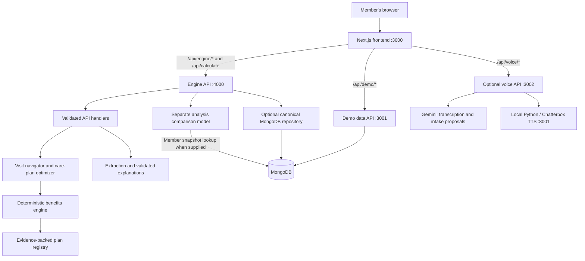

# CareWindow

CareWindow is a dental-benefits planning prototype that helps people understand **when and where to get care, what their plan may pay, and how to fund the remaining cost**. It combines a member-facing web app with deterministic benefits and scheduling engines.

Dental treatment often spans several appointments and benefit years. Moving an appointment can affect deductibles, annual maximums, expiring funds, or dentist-required healing intervals. CareWindow makes these tradeoffs visible through alternative schedules, cost breakdowns, and source-backed explanations.

The project is a synthetic-data demo. Its plans, providers, appointments, members, and claims are fictional; it does not connect to real carrier eligibility or appointment booking. Estimates are not medical, dental, insurance, or financial advice.

## What the application does

- **Benefit Passport:** shows plan identity, coverage, remaining benefits, pending reservations, and the evidence behind plan rules.
- **Visit Navigator:** compares providers and appointments before a visit, accounting for expected costs, network status, travel, availability, and urgent symptoms.
- **Care Plan Optimizer:** schedules confirmed procedures inside dentist-approved windows, respects dependencies and healing intervals, and compares costs across benefit years.
- **Member controls:** lets people change priorities, adjust budget and travel preferences, pin appointments, and inspect cost and timing differences between alternatives.
- **Treatment intake:** supports manual entry, a sample report experience, and an optional live voice assistant. Proposed facts must be reviewed before calculation.

For example, the bundled engine scenario plans a root canal, crown, and filling. The crown must follow the root canal, while the filling can move within its approved window. The engine compares earlier completion against a schedule using the next benefit year's balances, then shows the effect on member cost and monthly funding.

## Architecture at a glance

The repository contains two independently installed TypeScript projects: [`frontend/`](frontend/) and [`backend/`](backend/). The frontend owns presentation and intake state. The backend owns calculations, scheduling, plan evidence, and database access. There is no root npm workspace or root application server.



Browser requests use the frontend's own origin. Next.js rewrites `/api/engine/*` to the engine and uses server route handlers to proxy calculation, demo-data, and voice requests. Backend URLs and credentials stay on the server. MongoDB can be local or hosted in Atlas.

### Two frontend journeys

Both journeys exist today, but they use different domain models:

| Journey | Frontend entry | Backend path | Scope |
| --- | --- | --- | --- |
| Engine demo | `/care-window` | `/api/engine/*` -> engine `/api/*` | Canonical synthetic scenario, evidence-backed DPPO benefits, providers, funding, rollover, and scheduling |
| Intake and comparison | `/analysis/new` -> intake -> confirmation -> comparison | `/api/calculate` -> engine `/api/calculate` | A narrower confirmed, in-network PPO model: two benefit years and up to four procedures |

The second path is implemented in [`backend/src/analysis/`](backend/src/analysis/). It shares money and date helpers with the canonical engine but performs its own comparison calculations. For database-linked members, the server reloads the matched snapshot and linked plan, replacing submitted current benefit balances and rules. Its conservative estimates reserve known projected pending payments, leave pending deductible effects unchanged, and exclude rollover-bank spending and prospective awards. Incomplete or unsupported source facts require confirmation. Changes to the canonical benefits engine do not automatically update this compatibility model.

### Backend layers

| Layer | Location | Responsibility |
| --- | --- | --- |
| Domain contracts | [`backend/src/domain/`](backend/src/domain/) | Zod schemas, money/date primitives, API envelopes, provenance, and module interfaces |
| Plan registry | [`backend/data/`](backend/data/) | Synthetic source documents and generated plan definitions with exact evidence quotes |
| Benefits | [`backend/src/benefits/`](backend/src/benefits/) | Effective plan resolution and simulation of claims, deductibles, maximums, limits, network pricing, and rollover |
| Optimization | [`backend/src/optimizer/`](backend/src/optimizer/) | Candidate schedules, benefit-engine evaluation, funding allocation, and ranking |
| API | [`backend/src/api/`](backend/src/api/) | Framework-independent handlers, HTTP servers, validation, request IDs, and runtime composition |
| Persistence | [`backend/src/db/`](backend/src/db/) | MongoDB connections, migrations, canonical inputs, and computation audit records |
| Data normalization | [`backend/src/adapter/`](backend/src/adapter/) | Explicit mappings from Mongo demo documents into validated optimizer data; the shapes are not interchangeable |
| Analysis comparison | [`backend/src/analysis/`](backend/src/analysis/) | The separate calculation model for the original intake journey |
| AI and voice | [`backend/src/ai/`](backend/src/ai/), [`backend/src/voice/`](backend/src/voice/), [`backend/voice/`](backend/voice/) | Extraction, explanation validation, conversation sessions, and local speech synthesis |

The canonical registry contains Northwind Standard, Value, and Enhanced DPPO options for 2026 and 2027. Each rule carries a status, source reference, page, and literal quote. [`build-registry.ts`](backend/data/tools/build-registry.ts) produces normalized definitions from the synthetic documents.

### How a care plan is produced

1. The UI loads synthetic inputs from `/api/scenario`, then requests the Benefit Passport and Visit Navigator.
2. Intake extracts candidate procedures. The member reviews the clinical fields and explicitly confirms them through `/api/intake/confirm`.
3. `/api/care-plan` validates the request and builds candidates inside confirmed care windows, filtered by availability, specialty, travel limits, and schedule locks.
4. The optimizer enumerates schedules respecting dependencies and distinct appointment slots. Every financial evaluation calls the benefits engine.
5. Funding allocation accounts for cash and supported benefit accounts or payment arrangements. If no schedule fits the hard monthly limit, the result exposes funding gaps.
6. The selected mode ranks alternatives: `BALANCED`, `LOWEST_TOTAL_COST`, `EARLIEST_SAFE_COMPLETION`, or `SMOOTHEST_PAYMENTS`. Results include best/worst cost ranges, benefit states after each event, funding, warnings, calculation traces, and next actions.
7. `/api/explain` recomputes the result from its request and validates the explanation against computed amounts, dates, and evidence.

Search is bounded for larger candidate sets. Solver metadata reports the bounds and work performed, so recommendations can be interpreted within the explored search space.

### Calculation and trust boundaries

- **Reproducible calculations:** currency uses integer cents, percentages use basis points, and plan shares round half up per line before caps. Engines receive an explicit `as_of` timestamp rather than reading the clock.
- **Evidence before certainty:** only verified rules support definitive estimates. Missing, conflicting, stale, or unsupported inputs produce typed issues; unknown amounts are never silently treated as zero.
- **Clinical constraints come from people:** extraction cannot confirm a procedure or grant permission to delay treatment. Optimization stays within supplied, confirmed clinical constraints.
- **AI does not calculate benefits:** the canonical AI module currently uses a deterministic synthetic card parser and template explanations. Live Bedrock extraction is deferred despite configuration placeholders and an SDK dependency. The separate Gemini voice service proposes intake facts.
- **Versioned contracts:** the canonical contract is currently **1.8.0**, marked `FROZEN`. API responses carry contract version, request ID, generation source, and synthetic-data metadata. `/api/calculate` has its own response model.

### Frontend state and adapters

The app uses Next.js 16, React 19, Tailwind CSS 4, Radix/shadcn components, and Auth.js for optional Google sign-in. [`frontend/src/features/`](frontend/src/features/) groups workflows; [`frontend/src/components/`](frontend/src/components/) holds shared UI, brand, and motion components.

The intake journey uses a reducer and provider in [`features/analysis/`](frontend/src/features/analysis/). Manual, report, and voice proposals feed one draft and evidence model. User edits are preserved, conflicting sources stay visible, and confirmation gates calculation. Request IDs, revisions, and session epochs prevent stale calculation replies from restoring obsolete results.

Typed interfaces in [`lib/adapters/`](frontend/src/lib/adapters/) separate workflows from report, voice, calculation, history, and authentication services. `NEXT_PUBLIC_CAREWINDOW_MODE` selects `live` by default or explicit `demo` adapters. Live adapters report unavailable services instead of silently returning fixtures. `/care-window` uses its engine adapter directly, independently of this mode switch.

### Persistence and datasets

There are two distinct database concerns:

- **Canonical engine data:** `plan_registries` and `demo_scenarios` hold validated, checksummed inputs. In MongoDB mode, runtime handlers restore canonical member/provider facts for engine requests while allowing budget, availability, and travel preferences. Successful care plans are stored in `care_plan_results` with request/result hashes and registry version. Exact request-ID replays are idempotent; collisions cannot overwrite a record.
- **Imported demo population:** collections including `plans`, `member_snapshots`, `claims`, `providers`, `price_quotes`, `appointments`, and `procedure_cards` support the separate demo data API. The raw import package is not checked in. Canonical engine seeding does not populate this dataset.

Drafts and transcripts stay in application memory rather than browser local storage. Demo history is session memory. Account-owned history endpoints are not implemented, and engine audit records are separate from the frontend saved-history feature. Google sign-in supplies session identity; it does not complete account persistence or production member-data authorization.

## Run locally

Use Node.js 22.18+ and npm. Install dependencies separately in `backend/` and `frontend/`; both have committed lockfiles.

### Start the engine demo

In one terminal:

```bash
cd backend
npm ci
npm run serve
```

With `MONGODB_URI` unset, the engine loads checked-in synthetic inputs and needs no database or AI credentials. If `backend/.env.local` defines `MONGODB_URI`, it selects database mode and requires a seeded canonical dataset. `AI_MODE=synthetic` keeps canonical extraction and explanations deterministic.

In another terminal, from the repository root:

```bash
cd frontend
npm ci
npm run dev
```

Open **http://localhost:3000/care-window** to explore the Benefit Passport, Visit Navigator, and Care Plan Optimizer. To run the same core scenario without a browser, use `npm run demo:cli` from `backend/`.

For the simulated intake experience, set `NEXT_PUBLIC_CAREWINDOW_MODE=demo` in `frontend/.env.local`, restart the frontend, and open `/analysis/new`. This uses sample report/voice data and fixture-preview calculations; `/care-window` still requires the engine server.

### Use MongoDB

Copy [`backend/.env.example`](backend/.env.example) to `backend/.env.local` and configure `MONGODB_URI` and `MONGODB_DB` for local MongoDB or Atlas. From `backend/`:

```bash
npm run db:seed
npm run serve
```

`db:seed` seeds the canonical synthetic registry and scenario idempotently. A configured database with invalid, missing, or corrupted canonical data stops engine startup rather than falling back to files.

For the imported demo population, run `npm run dev:api` in another backend terminal. It expects the separate demo dataset to be present already. `npm run db:verify:demo` checks that dataset; `npm run db:verify:engine` exercises canonical seeding and audit persistence and **writes synthetic records**. `npm run db:verify` runs both checks.

### Service configuration

Copy [`frontend/.env.example`](frontend/.env.example) to `frontend/.env.local` when overriding defaults or configuring sign-in. Restart the relevant service after changing its environment.

| Service | Command | Default port | Configuration |
| --- | --- | --- | --- |
| Frontend | `frontend`: `npm run dev` | 3000 | `NEXT_PUBLIC_CAREWINDOW_MODE=live` or `demo` |
| Engine API | `backend`: `npm run serve` | 4000 | Backend `PORT`; frontend `CAREWINDOW_ENGINE_URL` defaults to `http://localhost:4000` |
| Demo data API | `backend`: `npm run dev:api` | 3001 | Backend `BACKEND_PORT`; frontend `BACKEND_BASE_URL` defaults to `http://127.0.0.1:3001` |
| Voice API, optional | `backend`: `npm run dev:voice` | 3002 | Backend `GEMINI_API_KEY` and `VOICE_PORT`; frontend `VOICE_BACKEND_URL` defaults to `http://127.0.0.1:3002` |
| Speech synthesis, optional | Managed by the voice server | 8001 | `CHATTERBOX_URL`, `CHATTERBOX_DEVICE`, and the Python environment |

The engine's `ALLOWED_ORIGINS` defaults to `http://localhost:3000`; update it if the frontend runs elsewhere. Keep MongoDB, Google, and Gemini credentials server-side and out of `NEXT_PUBLIC_*` variables.

Follow the [voice setup guide](backend/docs/voice-assistant.md) for the separate Python 3.11/Chatterbox environment and GPU setup. Voice uses HTTP streaming, Gemini for transcription and proposals, and local Chatterbox for speech. Sessions expire and conversation state stays in memory; this optional service sends utterances and recent conversation turns to Gemini.

Follow the [Google sign-in guide](frontend/docs/google-auth.md) for `AUTH_SECRET`, `AUTH_GOOGLE_ID`, and `AUTH_GOOGLE_SECRET`. Neither voice nor Google sign-in is required for the canonical engine demo.

## Current scope and unfinished integrations

| Area | Current implementation |
| --- | --- |
| Canonical benefits and optimization | Synthetic DPPO calculations, plan-year transitions, rollover, funding, claim/self-pay comparisons, modes, and locks |
| Original analysis calculation | Connected to `/api/calculate`; separate limited model with server-reloaded member benefits and explicit conservative-estimate limitations |
| Member/provider demo data | MongoDB-backed synthetic records; requires the imported demo dataset |
| Voice intake | Connected when Gemini and local speech are configured; simulated conversation in demo mode |
| Google sign-in | Implemented when OAuth settings are configured |
| Arbitrary PDF analysis | Live adapter exists, but `/api/reports` and `/api/report-jobs/*` are not implemented; demo analysis supports the bundled sample |
| Standalone typed interpretation | `/api/interpret` is not implemented; typed turns inside a live voice conversation use the voice service |
| Account history and profile persistence | Proposed adapters/endpoints; no durable account-owned analysis history |
| Production payer data and booking | Proposed architecture only; no real eligibility, claims, network-directory, or booking integration |

DHMO, indemnity, and discount-plan adjudication, coordination of benefits, and orthodontic installment adjudication are outside the canonical MVP's supported calculations. See the [production architecture plan](backend/docs/production-architecture-plan.md) for the future insurance-ID-to-care-plan design.

## Repository map

```text
backend/
  src/                 Domain, benefits, optimizer, APIs, database, analysis, AI, voice
  data/                Synthetic source documents and normalized plan registry
  fixtures/            Synthetic scenarios, golden results, mock responses
  tests/               Contract, unit, acceptance, integration, and data checks
  scripts/             Verification, canonical seeding, golden and freeze tooling
  voice/               Python speech service and setup
  docs/                Contracts, decisions, workflow, reviews, production plans
frontend/
  src/app/             Pages, layouts, auth routes, and server proxies
  src/features/        User workflows and analysis state
  src/lib/             Frontend domain types, adapters, and server bridges
  src/components/      Shared UI, brand, and motion components
  src/fixtures/        Explicit demo-mode samples
  tests/               Frontend domain, reducer, and adapter tests
docs/                  Integration reports and MVP iteration history
integration-audit/     Recorded probes and integration evidence
src/                   Earlier root-level demo proxy scaffold; active app is frontend/
```

## Verification and further reading

From `backend/`, `npm run verify` runs frozen-contract checks, the independent golden calculation check, typecheck, lint, and the contract, data/unit, acceptance, and integration suites. Database verification is separate. The backend executes TypeScript through `tsx` and has no build script.

From `frontend/`:

```bash
npm run typecheck
npm run lint
npm test
npm run build
```

The golden check is independent of engine code. Acceptance tests cover benefit invariants, clinical constraints, evidence, determinism, funding, modes, and locks. See the [browser-check instructions](frontend/scripts/care-window-browser.md) for UI verification.

Start with these references when contributing:

- [Canonical contract](backend/docs/contracts/CONTRACT-v1.md) and [changelog](backend/docs/contracts/CHANGELOG.md): API/domain definitions and version history.
- [Backend workflow](backend/docs/workflow.md): ownership and the change procedure for frozen contracts, fixtures, scripts, and acceptance tests.
- [Frontend adapter contracts](frontend/docs/adapter-contracts.md): service boundaries and expected wire models.
- [MVP requirements](CAREWINDOW_MVP_REQUIREMENTS.md): intended product behavior and architecture invariants.
- [Production architecture plan](backend/docs/production-architecture-plan.md): proposed real-data integrations and member authorization.

Some subsystem READMEs and handover documents describe earlier implementation stages. Use this overview for the current system layout, and check source code and contract versions before relying on historical status claims.
