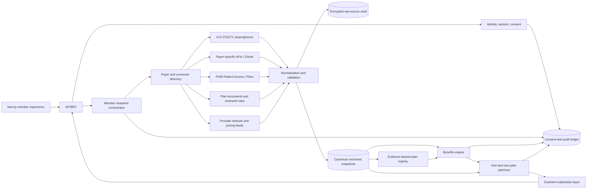

# Production architecture plan: insurance ID to care plan

Status: proposed production v2 architecture

Updated: 2026-10-03

Scope: dental eligibility, benefits, member state, provider/pricing data, and the existing deterministic optimizer

## 1. Product outcome

The intended experience is:

1. The user enters their insurance/member ID once.
2. The system identifies the member and active dental coverage.
3. The user verifies their identity and grants access when that has not already
   happened through a trusted employer, payer, or clinic session.
4. The app assembles a current, source-backed member snapshot.
5. The app shows benefits, remaining balances, network/provider information,
   treatment-plan costs, and optimized timing/funding options.

The first screen can contain only one visible field **when the surrounding
session already supplies payer and identity context**. A member ID by itself is
not globally unique, is not authentication, and must never be enough to reveal
health or coverage data.

For a direct-to-consumer flow, the minimum safe experience is normally:

- payer/carrier (selected, inferred from a card, or supplied by a partner);
- member ID;
- identity verification, such as payer OAuth or a matched factor plus OTP; and
- clear authorization/consent for the requested data.

The product should promise **“load everything available from your verified
sources”**, not “every field will always be available.” Every missing, stale,
estimated, or user-entered fact must be visible as such.

## 2. Relationship to the current MVP

The frozen contract v1.1.0 remains the source of truth for the synthetic MVP.
It intentionally requires `synthetic_data: true` and keeps live eligibility,
claims, and booking integrations out of scope. Production member lookup must be
a new, versioned boundary; it must not silently weaken or mutate v1.

| Area | Current v1.1 | Production v2 target |
|---|---|---|
| Identity | Synthetic member fixture | Authenticated user, identity match, consent |
| Coverage | Frozen plan registry | Exact payer, group, network, plan, and effective version |
| Accumulators | Synthetic snapshot | Sourced snapshots with observation time and freshness |
| Benefits | Deterministic engine | Same principle, fed by normalized verified plan rules |
| Providers/prices | Synthetic options | Network directory plus dated contracted/quoted prices |
| Optimizer | Deterministic | Reused behind a server-owned member snapshot |
| API metadata | Always synthetic | Environment and source provenance without exposing PHI |
| Audit | Test traceability | Immutable access, consent, source, and computation events |

The imported `data/reference/dental-demo-data-package-v1/` package remains
quarantined reference data. It is useful for adapter and migration tests only
after normalization; it is not compatible with the frozen v1 scenario as-is.

## 3. Recommended operating model

### Preferred pilot: trusted-context onboarding

Launch through one employer, dental practice, or payer partner. Its authenticated
session supplies the payer, tenant, and verified person context. The user enters
only their member ID, or the member ID is prefilled. This is the closest safe
implementation of the desired one-field experience.

### Supported fallback: direct consumer onboarding

Ask for payer and member ID, then hand off to payer OAuth when available. When it
is not available, use the minimum contracted eligibility match fields and a
step-up verification method. Any OTP must go to an already verified, on-file
channel supplied by the payer/partner or an approved identity provider, never a
new contact entered in the same lookup. Never distinguish “member exists” from
“member does not exist” before verification; generic responses reduce
enumeration risk.

### Do not build around a single data protocol

Dental coverage is fragmented. X12 270/271 is the adopted eligibility/benefits
transaction and can return coverage and financial information, but access
usually requires an authorized provider, payer, or clearinghouse relationship.
FHIR Patient Access APIs can supply claims and clinical data for covered payer
types, but standalone dental plans were excluded from the 2020 CMS requirement.
Payer-specific APIs, plan documents, and provider/pricing feeds are therefore
still required. All of them should sit behind the same connector interface.

## 4. Target architecture



### Component responsibilities

| Component | Required responsibility |
|---|---|
| API/BFF | Session-bound API, CSRF protection, rate limits, response shaping, no secrets or raw payer payloads in the browser |
| Identity and consent | Authentication, member-to-user binding, verification level, consent scope/version, revocation, session timeout |
| Payer directory | Resolve payer/network and choose an authorized connector; never guess a plan from member ID alone |
| Connector gateway | Standard start/poll/result interface, idempotency, timeout/retry/circuit breaker, encrypted credentials |
| Snapshot orchestrator | Run source requests, deduplicate, reconcile, assign freshness, expose complete/partial/failed progress |
| Normalizer | Validate source payloads and map facts into versioned canonical records without inventing absent values |
| Plan registry | Exact effective-dated rules with evidence; proposed extracted rules require review before calculation |
| Benefits engine | Authoritative money calculation using verified rules and member accumulators |
| Optimizer | Rank only feasible choices using immutable input snapshot IDs and deterministic policy versions |
| Explanation layer | Explain engine output; never calculate or overwrite dollars, dates, or coverage |
| Audit/observability | Record access and decisions with redacted telemetry; keep PHI and credentials out of logs |

## 5. Required data

### 5.1 Lookup, identity, and consent

The browser should collect as little as possible, but the server must have:

| Field | Requirement |
|---|---|
| `tenant_id` / partner context | Required for routing and authorization |
| `payer_id` | Required; supplied by SSO/partner, selected by user, or confirmed after card scan |
| `member_id` and subscriber relationship | Required; encrypted/tokenized at rest and masked in UI/logs |
| Group number | Conditional; required only by that payer/connector |
| Match fields | Conditional minimum: for example name, date of birth, ZIP, or subscriber data |
| Requesting organization/provider | Required when the eligibility channel or purpose requires it |
| Purpose and service date/type | Required for scoped eligibility queries and audit |
| Verification result | Method, assurance level, time, failures, and expiration |
| Consent grant | Subject, scopes, disclosure text version, grant/revoke time, and source |

Do not place full lookup payloads in URLs, analytics, browser storage, or exception
messages.

### 5.2 Canonical member snapshot

The optimizer should receive a server-created immutable `member_snapshot_id`,
not a client-authored member object. The snapshot should contain these groups:

| Group | Minimum fields |
|---|---|
| Coverage | status, coverage dates, payer, product, group, plan, plan type, network IDs, member relationship |
| Plan version | exact effective version, plan year, annual-period rule, jurisdiction, registry/mapping version |
| Accumulators | deductible/max amounts and remaining/used values by level and network, observed time, source |
| Benefit rules | CDT/service category, coverage %, copay, deductible applicability, frequency, age, waiting period, exclusions, authorization, downgrade/alternate benefit |
| Claims | adjudicated and pending summaries, service date, CDT/category, allowed/member/plan amount, status, source ID |
| Coordination | primary/secondary order and only explicitly supported coordination rules |
| Funding | HSA/FSA balance and expiry plus user-entered monthly budget, each with source/status |
| Availability | user constraints, travel limit, blackout dates, and provider appointment observations |
| Data quality | completeness, source availability, observed/effective/expiry times, conflicts, missing fields, warnings |

Unknown values remain `unknown`/`null` with an issue code. They must never be
converted to zero, false, out-of-network, or not-covered for convenience.

### 5.3 Plan rules and evidence

Every fact that changes a calculation needs:

- stable fact and plan-version IDs;
- typed rule/value and units;
- effective and termination dates;
- network/service applicability;
- verification status (`verified`, `proposed`, `conflicted`, `unsupported`);
- source document/system and literal location or transaction reference;
- retrieved/observed time, mapping version, and integrity checksum; and
- reviewer identity/time for rules created from documents.

AI may propose a mapping from an EOC/SPD or benefit document. Only reviewed,
verified rules may enter authoritative calculations.

### 5.4 Provider and price snapshots

Required provider data includes provider/organization identifiers, location,
specialty, network and plan association, accepting-new-patient status when
available, contact/accessibility fields, observation time, and source.

Price data must distinguish:

- submitted charge;
- payer allowed amount;
- contracted estimate;
- provider cash quote; and
- member estimate.

Every price needs procedure, provider/location, plan/network, effective or quote
date, source, and confidence/status. “In network” and an allowed amount expire;
they are not permanent provider attributes.

### 5.5 Treatment-plan input

Each proposed procedure needs CDT code, tooth/surface when applicable, quantity,
provider fee/quote, clinical dependency, urgency and safe/latest dates, source,
and confirmation status. Clinical urgency must come from the treating dentist or
another explicit clinical source, never from the optimizer or language model.

### 5.6 Provenance on every external fact

Use one shared provenance envelope:

```text
source_system       transaction/resource/document identifier
observed_at         when the source reported the fact
effective_period    when the fact applies
stale_after         when refresh is required
verification_status verified | proposed | conflicted | unsupported
mapping_version     connector + canonical-schema version
raw_payload_ref     encrypted server-side reference, never returned to UI
```

## 6. Source strategy and authority

| Need | Preferred source | Fallback | Important limitation |
|---|---|---|---|
| Active eligibility and high-level benefits | Contracted X12 270/271 or payer eligibility API | Authorized portal/manual verification | Responses vary; not every detailed plan rule or accumulator is guaranteed |
| Claims/history | Member-authorized payer API/FHIR or payer feed | EOB upload and confirmed extraction | Availability varies, especially for standalone dental coverage |
| Exact plan rules | Payer plan feed plus reviewed EOC/SPD | Reviewed document ingestion | Documents must be tied to exact group/product/effective period |
| Accumulators | Payer member/eligibility API | Recent EOB plus explicit “may be stale” | Pending/unsubmitted claims can make values lag |
| Provider network | Payer directory/Plan-Net when available | Payer portal or contracted directory vendor | Must be tied to exact plan/network and observation time |
| Allowed/cash prices | Payer contract feed or provider quote | Historical estimate | Directory membership does not imply an exact procedure price |
| Treatment and urgency | Dentist-confirmed treatment plan | User upload awaiting confirmation | Never infer clinical necessity or deadline |
| Funding/availability | User or integrated account source | User entry | Keep separate from insurance benefits |

## 7. Frontend requirements

### 7.1 Screens and states

1. **Start** — one member-ID field when payer and identity are in session;
   otherwise payer search plus member ID. Include card scan as an optional helper,
   not as proof of identity.
2. **Verify and authorize** — payer OAuth where possible; otherwise step-up match
   and OTP. Show requested data, purpose, retention, and revocation path.
3. **Retrieving coverage** — show meaningful source progress: locating plan,
   checking eligibility, loading balances, loading network, and normalizing rules.
4. **Coverage passport** — coverage status, plan year, deductible/max, categories,
   limitations, recent claims, and explicit data-quality banner.
5. **Treatment intake and confirmation** — upload/paste/enter a treatment plan,
   review extracted CDT/tooth/fee/urgency values, and confirm before optimization.
6. **Care options** — before/after cost, recommended provider/timing/funding,
   alternative choices, assumptions, constraints, and source-backed explanation.
7. **Sources and corrections** — per-fact source and “as of” time, missing/conflict
   details, refresh, manual correction request, and revoke/delete controls.

### 7.2 Required UI behavior

- Mask member IDs and sensitive demographics except while actively editing.
- Bind all member views to the authenticated session; never accept a member ID in
  a browser URL to retrieve data.
- Use generic pre-verification errors to prevent member enumeration.
- Show `Verified`, `Partial`, `Stale`, `User-entered`, and `Needs confirmation`
  labels consistently.
- Put plan effective dates and “last checked” beside benefit totals.
- Treat zero, unknown, not applicable, and source unavailable as distinct states.
- Preserve user progress during a connector delay; provide retry and manual
  fallback without duplicating requests.
- Meet WCAG 2.2 AA, keyboard, screen-reader, mobile, plain-language, and currency/
  date localization requirements.
- Warn before session expiry and clear sensitive client state on sign-out.

### 7.3 Dashboard definition of “everything”

The first useful dashboard should include:

- active/inactive coverage and effective period;
- plan/network identity;
- individual/family deductible and annual maximum usage/remaining;
- category-level benefits and limitations;
- recent and pending claim indicators when available;
- provider network status with freshness;
- treatment-plan estimate and savings opportunity;
- optimized now/later sequence, member cost, plan payment, funding, and constraints;
- all assumptions, missing data, and source timestamps.

## 8. Proposed v2 API boundary

Keep v2 separate until it has its own reviewed contract and threat model.

| Endpoint | Purpose |
|---|---|
| `POST /api/v2/member-lookups` | Start a session-bound lookup; return opaque lookup ID and required next action |
| `POST /api/v2/member-lookups/:id/verify` | Complete payer OAuth callback or step-up verification |
| `GET /api/v2/member-lookups/:id` | Poll source progress without returning unverified member facts |
| `POST /api/v2/member-snapshots/:id/refresh` | Idempotently refresh authorized sources |
| `GET /api/v2/member-snapshots/:id/passport` | Return the normalized, redacted benefit view |
| `POST /api/v2/treatment-plans` | Create/confirm treatment input tied to the authenticated member |
| `POST /api/v2/care-plans` | Run the existing engine by snapshot and treatment-plan IDs |
| `GET /api/v2/care-plans/:id` | Return deterministic result plus provenance and quality flags |

Required cross-cutting behavior:

- opaque IDs, ownership checks, short-lived authorization, idempotency keys;
- asynchronous connector jobs with bounded retries and circuit breakers;
- explicit partial-success responses and stable machine-readable issue codes;
- request, snapshot, registry, policy, and optimizer version IDs on every result;
- no raw member/plan object accepted from the browser for money calculation; and
- audit events for access, refresh, consent, correction, and optimization.

## 9. Storage and security baseline

Separate the following stores and access policies:

- identity/member-link store;
- consent and immutable audit ledger;
- encrypted raw-source vault with short, explicit retention;
- normalized effective-dated snapshot store;
- reviewed plan registry;
- treatment plans and optimization runs; and
- redacted operational telemetry.

Before handling real member data, require:

- a documented HIPAA/privacy applicability assessment and security risk analysis;
- BAAs and data-use terms for vendors that handle ePHI when applicable;
- least-privilege service/user access, MFA for staff, and break-glass controls;
- TLS in transit, encryption at rest, managed keys, rotation, and secret vaulting;
- field-level protection/tokenization for member identifiers;
- audit controls, integrity checks, authentication, and transmission security;
- tenant isolation and automated object-level authorization tests;
- no PHI in analytics, URLs, logs, traces, support tools, or model prompts;
- retention, deletion, export, incident-response, and consent-revocation procedures;
- dependency, SAST, secret, container, and infrastructure scanning; and
- abuse controls for enumeration, credential stuffing, replay, and bulk export.

This is an engineering baseline, not a legal determination. Compliance and
privacy counsel should approve the exact role, authorization, notices, and data
retention model before a production pilot.

## 10. Fake-data end-to-end test plan

Build the production-shaped flow with fabricated records before connecting a
real payer. The fixture must contain no real person, carrier-confidential plan,
or provider data.

### Golden journey: before and after

| Moment | Expected UI/data |
|---|---|
| Before lookup | No member facts in browser state; only trusted payer context and blank member ID |
| After ID submission | Opaque lookup ID and `verification_required`; no coverage disclosure |
| After verification | Active exact plan, source timestamps, and progressive load statuses |
| After snapshot assembly | Benefits/accumulators/providers/prices with verified/partial/stale labels |
| Before treatment confirmation | Extracted procedures are proposed and cannot drive final optimization |
| After confirmation | Deterministic alternatives show before/after member cost and every source/assumption |

### Required fabricated scenarios

1. Exact active match with complete data.
2. Active member with partial accumulator and no claims source.
3. Inactive/future coverage without leaking member existence pre-verification.
4. Ambiguous dependents/subscriber relationship.
5. Wrong payer, member not found, and failed verification with identical safe
   pre-verification response behavior.
6. Payer timeout, retry, stale cache, and recovery without duplicate requests.
7. Conflicting plan document and eligibility result.
8. Pending claim that could change the remaining maximum.
9. Provider shown in network but price unavailable or stale.
10. Cross-year care plan, changed accumulators, and deadline constraints.
11. Duplicate refresh/optimization idempotency.
12. Cross-user and cross-tenant object access attempts.

### Test layers and gates

| Layer | Gate |
|---|---|
| Connector contract | Recorded synthetic payload maps deterministically; unknown fields remain unknown |
| Normalization | Schema, version, effective-date, conflict, and provenance tests pass |
| Benefits/optimizer | Existing golden money/feasibility tests plus the adapted fixture pass |
| API integration | Auth, consent, ownership, idempotency, partial success, and redaction pass |
| Browser E2E | Start → verify → passport → confirm → optimize → sources works on mobile and desktop |
| Security | Enumeration, IDOR, CSRF, rate-limit, log/trace PHI, expiry, and revocation tests pass |
| Resilience | Timeout, degraded source, stale cache, retry, and connector recovery tests pass |

The imported dental demo package can seed adapter cases after the mappings in
its `IMPORT-NOTES.md` are implemented. It must remain a separate test tenant and
must not replace the Northwind v1 golden scenario.

## 11. Delivery plan and next steps

### Phase 0 — finish and preserve the synthetic MVP

1. Finish the v1 benefits registry/engine.
2. Finish API, AI guardrails, and frontend routes against the frozen contract.
3. Run contract, unit, acceptance, integration, browser E2E, lint, typecheck,
   frozen-manifest, golden, and production-build gates.
4. Commit the current optimizer and quarantined reference-data work separately
   so v1 remains an auditable baseline.

Exit gate: all v1.1 acceptance tests pass with synthetic data and no network.

### Phase 1 — production-shaped fake-data vertical slice

1. Approve this operating model: trusted partner context or direct consumer.
2. Write ADRs for identity proofing, consent, payer routing, retention, and
   connector build-vs-buy.
3. Define a versioned v2 schema and issue catalog outside frozen v1 paths.
4. Implement session-bound opaque member snapshots and the connector interface.
5. Add one fake connector with complete, partial, stale, conflict, and outage
   payloads.
6. Build Start, Verify, Progress, Passport, Sources, and Care Options states.
7. Run the full fake-data matrix in section 10.

Exit gate: the browser flow works end-to-end without real PHI, and swapping the
fake connector does not change benefits or optimizer interfaces.

### Phase 2 — one authorized payer/clearinghouse sandbox

1. Select one launch payer/clearinghouse, geography, and covered plan family.
2. Complete security/privacy/vendor review and required agreements.
3. Obtain sandbox credentials and representative de-identified/contracted test
   payloads.
4. Implement eligibility routing and map the connector to canonical snapshots.
5. Import and review exact plan documents/rules for the pilot products.
6. Compare every mapped field to portal/manual verification and publish a
   coverage/completeness report.

Exit gate: deterministic sandbox reconciliation passes; no guessed facts enter
money calculations.

### Phase 3 — claims, accumulators, directory, and pricing

Add member-authorized claims/accumulator sources, provider network feeds, and
dated price sources one at a time. Each source needs freshness policy, conflict
rules, outage behavior, and a product-visible completeness level.

Exit gate: pilot users can tell which figures are verified, missing, stale, or
estimated and can still complete a safe degraded flow.

### Phase 4 — limited real-member pilot

Complete threat modeling, penetration testing, operational runbooks, access
reviews, audit review, support escalation, incident exercises, and calculation
reconciliation before enabling a small allow-listed population.

Exit gate: privacy/security approval, monitored accuracy thresholds, rollback,
and human support are all in place.

## 12. Immediate decision list

Resolve these before building a real connector:

1. Is launch B2B2C through an employer/practice/payer, or direct-to-consumer?
2. Which payer/clearinghouse and exact dental products are in the first pilot?
3. Does “everything” include claims history, provider prices, and secondary
   insurance, or only eligibility, benefits, accumulators, and optimization?
4. What authority/purpose permits each lookup, and who is the covered entity or
   business associate in the chosen model?
5. Which identity-proofing and consent flow is acceptable?
6. How fresh must eligibility, accumulators, network status, and prices be?
7. What is the raw and normalized data retention/deletion policy?
8. Which missing fields block optimization versus produce a labeled estimate?

Recommended defaults for the first pilot: trusted-context onboarding, one payer,
primary dental coverage only, current plan year, one network, X12/payer
eligibility plus reviewed plan documents, no secondary coordination, and no
claim that unavailable prices or pending claims are exact.

## 13. Standards and primary references

- [CMS eligibility and benefits transactions](https://www.cms.gov/files/document/eligibility-and-benefits-transactions.pdf) — X12 5010 270 inquiry and 271 response, including real-time financial/coverage information operating rules.
- [CMS Patient Access API FAQ](https://www.cms.gov/initiatives/burden-reduction/overview/interoperability/frequently-asked-questions/patient-access-api) — payer API data scope and dental-claims implementation context.
- [CMS Interoperability and Patient Access fact sheet](https://www.cms.gov/newsroom/fact-sheets/interoperability-and-patient-access-fact-sheet) — covered payer types, FHIR requirement, and standalone-dental exclusion.
- [CMS Interoperability and Prior Authorization API standards](https://www.cms.gov/initiatives/burden-reduction/overview/interoperability/implementation-guides-standards/application-programming-interfaces-apis-relevant-standards-implementation-guides-igs) — current CMS API and implementation-guide landscape.
- [HL7 Da Vinci PDex](https://hl7.org/fhir/us/davinci-pdex/) and [Plan-Net](https://hl7.org/fhir/us/davinci-pdex-plan-net/) — payer-data and provider-network FHIR implementation guides.
- [HHS HIPAA Security Rule summary](https://www.hhs.gov/hipaa/for-professionals/security/laws-regulations/index.html) — administrative, physical, and technical safeguard baseline.
