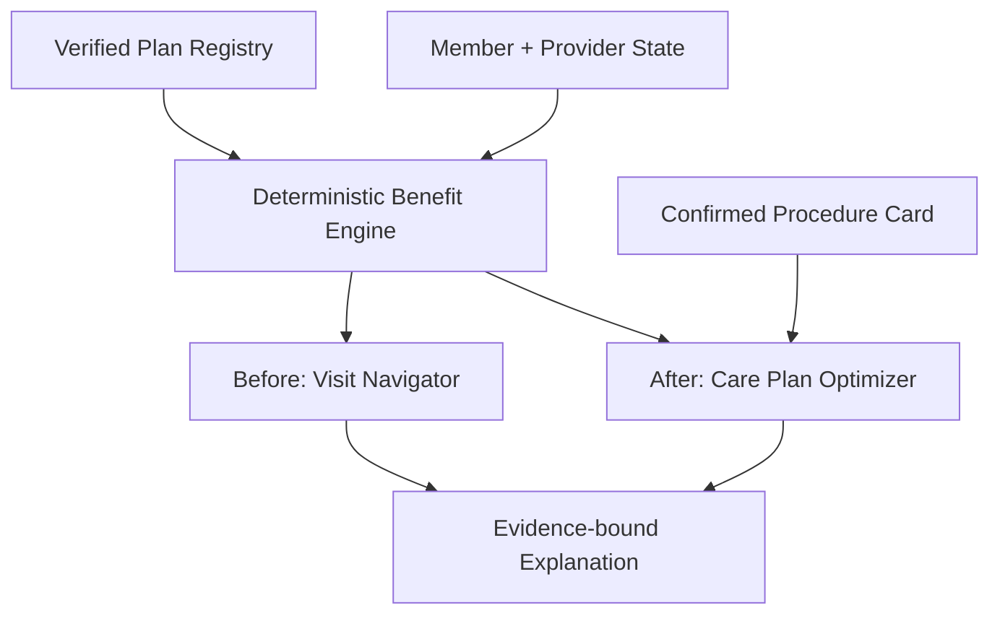

# Dental Payment & Scheduling Optimizer

## Deterministic Algorithm and Claude Multi-Agent Build Specification

**Hackathon:** Lincoln Financial Group codeLinc 11  
**Product concept:** A calm, evidence-backed assistant that helps members decide where to receive dental care, when to schedule dentist-approved care, how to use coverage, and how to fund the remaining cost.

---

## 1. Executive recommendation

Split the member experience into two modes, but make both modes use the same shared foundation:

1. **Before the visit — Visit Navigator**
   - Compare in-network and out-of-network providers.
   - Consider appointment availability, member availability, distance, expected visit cost, remaining benefits, and monthly budget.
   - Compare submitting a claim with a verified self-pay scenario only when the required rules and prices are known.
   - Before diagnosis, optimize access to care—not treatment timing that has not been approved by a dentist.

2. **After the visit — Care Plan Optimizer**
   - Read a treatment card, written estimate, or consented transcript.
   - Extract procedures, fees, urgency, safe treatment windows, dependencies, and healing intervals.
   - Require the member to confirm extracted clinical facts.
   - Generate a clinically valid, affordable timeline across plan years and payment sources.

The benefit calculation and optimizer must be deterministic. AI may extract candidate facts, retrieve supporting plan passages, and explain results. AI must not invent plan rules, calculate benefits, decide clinical urgency, or override the algorithm.



---

## 2. Three decisions that must remain separate

Do not combine these dates or decisions:

| Decision | Meaning |
|---|---|
| **Service date** | When treatment occurs; normally determines the applicable plan year and benefit rules. |
| **Claim/adjudication date** | When the claim is processed; determines whether benefit balances may still be pending. |
| **Payment date** | When the member pays; determines cash flow but does not normally move treatment into another benefit year. |

Also separate:

- **Pricing/claim route:** in-network claim, out-of-network claim, secondary coverage, or verified self-pay/no-claim option.
- **Funding source:** checking/cash, FSA, HRA, HSA, or a verified provider payment plan.

Use **in-network/out-of-network**, not “in-system/out-of-system.”

---

## 3. Source of truth: a Plan Registry, not one giant prose document

A human-readable comparison document is valuable, but it should not be the calculation database. Dental plans can vary by employer group, plan option, state, network, and benefit year.

Build a versioned **Plan Registry** containing:

1. Immutable source plan documents.
2. A normalized rule file for each exact plan version.
3. Page/section evidence attached to every rule.
4. Effective dates and applicability conditions.
5. Review status and document checksum.
6. A generated comparison document produced from the same verified data.

This prevents the document, UI, and algorithm from drifting apart.

### Exact plan identity

Resolve a plan using:

```text
carrier + employer/group + plan option + jurisdiction + network + coverage period
```

Never borrow a missing rule from a similarly named plan, another employer, another year, or general marketing material.

### Rule status

Every normalized rule has one status:

- `VERIFIED`: permitted in calculations.
- `UNVERIFIED`: display for confirmation, but do not calculate with it.
- `UNKNOWN`: request missing data.
- `CONFLICT`: block the affected result and request insurer review.
- `NOT_APPLICABLE`: explicitly excluded.

If a required rule is not verified, return `NEEDS_CONFIRMATION`. Never insert an “industry typical” value.

### Example evidence-backed rule

```yaml
- rule_id: coverage.major.in.2026
  rule_type: plan_share
  applies_when:
    network: in_network
    service_class: major
  value:
    rate: 0.50
    basis: allowed_amount_after_deductible
  status: VERIFIED
  effective_from: 2026-01-01
  effective_to: 2026-12-31
  evidence:
    source_id: demo-benefit-schedule-2026
    page: 2
    section: Major Services
    locator: table-1-row-8
```

Do structured lookup for calculations. Semantic/vector retrieval can display the supporting passage after the applicable rule has been selected, but it must not search across unrelated plans to determine a benefit.

### Plan-type strategy

Use a separate adjudication strategy per plan type:

- `DPPO`: deductible, allowed amount, percentage coverage, annual maximum.
- `DHMO`: procedure-level copay schedule and primary-dentist/network restrictions.
- `INDEMNITY`: plan allowance/UCR reimbursement rules.
- `DISCOUNT`: contracted discount schedule; not insurance.

For the hackathon, implement **DPPO only** and make unsupported plan types return a clear message. Create an extensible interface, not a false claim that every dental plan is supported.

---

## 4. Shared domain contracts

Freeze these contracts before parallel implementation.

### `PlanDefinition`

```text
plan_id, plan_version_id, plan_type
identity and effective dates
plan-year/reset rules
deductible rules
annual and lifetime maximum rules
coverage by plan-specific CDT/service class and network tier
waiting periods and frequency limitations
exclusions, alternate-benefit rules, and sublimits
rollover/MaxRewards rules
self-pay/claim-submission rules when documented
evidence reference on every rule
```

### `MemberState`

```text
observed_at
deductible remaining
annual maximum remaining
plan-paid year-to-date
pending claims/reserved benefit
previous procedure dates
secondary coverage
FSA/HRA/HSA balance and deadlines
hard and preferred monthly budgets
member availability and travel limit
```

### `ProviderOption`

```text
provider and location ID
network tier and verification timestamp
specialty
appointment slots and observation timestamp
contracted/estimated allowed amount
provider charge and verified cash quote
claim-submission/self-pay status
travel distance and time
```

### `ProcedureRecommendation`

```text
procedure ID
CDT code or plan-specific service category
tooth/area
dentist fee
earliest safe date
target date
latest safe date
urgency supplied by dentist
dependencies and minimum/maximum healing gaps
dentist-approved alternatives
source and confirmation status
```

### `OptimizationResult`

```text
ranked alternatives
service date, provider, claim route, and payment schedule
projected plan payment and member payment
benefit state after every event
monthly funding requirement
calculation and decision trace
applied plan-rule evidence
unresolved facts and confidence/range
```

AI-extracted procedures, codes, urgency, and deadlines begin as `UNVERIFIED`. They become optimizer inputs only after the member or dentist confirms them.

---

## 5. Before the visit: Visit Navigator

### Purpose

Choose the best access option without pretending to know treatment that has not yet been diagnosed.

### Inputs

- Visit intent: routine care, new concern, or follow-up for known care.
- Exact plan and current benefit snapshot.
- Candidate provider locations and timestamped network status.
- Next available appointments.
- Member availability, travel limit, and monthly budget.
- Expected exam/consult charge or a verified price range.
- Known future procedures only when the member already has them.
- Verified self-pay quote and claim-submission rules, if available.

### Safety gate

The system should route—not diagnose. If the member indicates severe pain, swelling, trauma, bleeding, or another potentially urgent concern, prioritize contacting a dentist and the earliest practical appointment. Do not recommend delay to save benefits.

### Output

Return at most three non-dominated choices:

1. **Best overall**
2. **Lowest estimated cost**
3. **Soonest appointment**

For every option, show:

- Network status and verification date.
- Appointment date and how it intersects with the member’s availability.
- Distance/travel time.
- Estimated member cost or range.
- Effect on known benefit balances.
- Concrete tradeoff: for example, “$180 less, 9 days later, 3 miles farther.”
- Missing or stale information.

Before diagnosis, any “save benefits for future care” result must be presented as a conditional scenario, not a treatment recommendation.

---

## 6. After the visit: Care Plan Optimizer

### Intake

Support:

- Photo of a procedure/treatment card.
- Written estimate upload.
- Manual entry.
- Consented audio recording and transcription.

Delete audio after transcription by default or offer that option prominently. The transcript parser creates editable procedure cards. It should extract only what was actually stated and mark inferred CDT codes as needing confirmation.

### Required confirmation screen

For every procedure, confirm:

- Procedure/code and tooth.
- Dentist fee.
- Dentist-stated urgency.
- Earliest and latest safe dates.
- Dependencies and healing intervals.
- Dentist-approved alternatives.

Use the wording “Your dentist said…” rather than “AI determined…”.

### Output

Produce a timeline that states:

- What to schedule.
- When to schedule it.
- Which provider/location was modeled.
- Whether insurance or a verified self-pay option is used.
- How the member responsibility is funded.
- Plan payment and member payment.
- Benefit balance afterward.
- Why the date was chosen.
- Plan clause and clinical source used.
- Next action, such as request an appointment or pre-treatment estimate.

A pre-treatment estimate can improve confidence, but it is not a guarantee of final payment.

---

## 7. Deterministic optimization algorithm

### 7.1 Candidate action

For each required procedure, build actions of the form:

```text
(provider, service_date, claim_route)
```

Funding is allocated after benefit adjudication because the actual member responsibility must be known first.

Reduce dates to meaningful decision points:

- Earliest available date.
- Dentist target/latest date.
- Last compatible slot before a plan reset.
- First compatible slot after a plan reset.
- Date before an FSA/HRA deadline.
- First date the member can meet the hard payment requirement.

### 7.2 Hard constraints

Reject candidates that violate:

- Dentist-confirmed safe treatment window.
- Procedure dependencies or healing intervals.
- Member or provider availability.
- Provider specialty requirement.
- Plan effective dates.
- Waiting-period or frequency rules.
- User hard travel limit.
- Funding-account eligibility and balance.
- Verified provider payment-plan terms.
- Claim/self-pay rules.

Do not allow the optimizer to choose between clinical alternatives unless the dentist explicitly approved each alternative.

Run affordability in two passes:

1. Search with the member’s hard monthly limit enforced.
2. If no schedule exists, return the safest schedule and exact funding gap. Never move urgent treatment beyond the dentist’s deadline to make the budget appear feasible.

### 7.3 Benefit state transition

Sort chosen procedures by **service date** and adjudicate chronologically.

```text
patient_charge =
  in-network claim     -> verified contracted/allowed responsibility basis
  out-of-network claim -> provider charge, including modeled balance bill
  self-pay             -> verified cash quote

eligible_basis = amount recognized by the exact plan rule
deductible_applied = min(deductible_remaining, deductible-eligible basis)
preliminary_plan_pay = coverage_rate × (eligible_basis - deductible_applied)

actual_plan_pay = min(
  preliminary_plan_pay,
  annual_maximum_remaining,
  applicable_sublimit_remaining
)

member_responsibility = patient_charge - actual_plan_pay
```

Update the applicable plan state after each claimed procedure. Reset deductibles and maximums only at the documented plan boundary. Calculate rollover/MaxRewards only from the exact documented threshold, network, claim, and timing conditions.

Use integer cents or a decimal money type—never binary floating point.

### 7.4 Funding allocation

Allocate the calculated member responsibility across eligible sources:

- Expiring FSA/HRA funds.
- Monthly cash budget.
- HSA funds above the user’s desired reserve.
- Verified zero-interest provider plan.
- Interest-bearing financing, including its total fees.

Do not blindly use that list as a fixed order. Compare deadlines, user preferences, total fees, and timing. Funding cannot occur before treatment unless the provider’s terms permit prepayment.

### 7.5 Objective function

Use hard constraints plus lexicographic ranking rather than one opaque weighted score:

```text
1. No clinical or plan-rule violation
2. Minimum clinical lateness/unscheduled-care penalty
3. Minimum funding shortfall
4. Minimum total member cost plus verified fees
5. Smoothest monthly cash requirement
6. Minimum travel/wait/visit burden
7. Minimum waste of expiring eligible funds
```

Benefit utilization is a tie-breaker only among necessary, dentist-approved care. Do not maximize benefit use as a primary goal; that could reward unnecessary services.

Return three alternatives when possible:

- Lowest total cost.
- Earliest safe completion.
- Smoothest monthly payments.

### 7.6 Search method

For an MVP with approximately 3–8 procedures and a few meaningful dates/providers, use exact enumeration with backtracking and pruning.

```ts
function optimize(input: OptimizationInput): OptimizationResult {
  validateVerifiedPlanRules(input.plan);
  const candidates = buildCandidateActions(input);
  const frontier = [];

  for (const schedule of backtrack(candidates, input.dependencies)) {
    if (!passesHardConstraints(schedule, input)) continue;

    const benefits = simulateChronologically(schedule, input.planState);
    const funding = allocateFunding(benefits.memberLiabilities, input.member);
    retainIfNonDominated(frontier, schedule, benefits, funding);
  }

  return rankWithDeterministicTieBreaks(frontier);
}
```

A basic greedy algorithm is not sufficient. A locally cheap decision can consume the annual maximum, change deductible state, miss a plan reset, or reduce the value of a later procedure. Greedy may be retained only as a benchmark or time-limited fallback labeled as non-optimal.

For a larger production problem, replace enumeration with dynamic programming, mixed-integer optimization, or CP-SAT while retaining the same adjudication and audit interfaces.

---

## 8. Self-pay and “preserve benefits” logic

Do not automatically recommend paying cash to preserve the annual maximum. Compare the complete known care horizon.

Require:

- Actual provider cash quote.
- Confirmation that self-pay/no-claim is permitted.
- Whether a network provider must submit a claim.
- Whether the network discount is retained.
- Whether the spending affects deductible, maximum, or frequency records.
- A known future procedure or explicit user-entered reserve scenario.

If any required fact is missing, show insurance and possible self-pay as scenarios and label the unknown. Do not declare a winner.

Example output:

> If the confirmed crown occurs this plan year, paying the verified $180 cash price for today’s filling is projected to reduce total member cost by $70. If the crown does not occur, submitting today’s filling claim is projected to cost $45 less. Confirm claim-submission rules with the office before choosing.

---

## 9. Evidence-bound AI design

AI has four allowed jobs:

1. Extract candidate rules from a plan document.
2. Extract candidate procedures and dentist statements from a card/transcript.
3. Retrieve the source passage for already selected rule IDs.
4. Explain a finalized deterministic decision trace.

The explanation model receives only:

- Final engine output.
- Applied rule IDs.
- Short evidence passages for those rules.
- Confirmed clinical facts.
- Explicit missing fields.

Reject an explanation if it:

- Contains a dollar amount absent from engine output.
- Makes a plan claim without a rule/evidence ID.
- Uses the wrong plan version.
- Turns unknown data into an assumption.
- Changes urgency or timing supplied by the dentist.

Recommended response contract:

```json
{
  "summary": "Estimated member cost is $525.",
  "claims": [
    {
      "text": "This plan pays 50% of the allowed amount for this major service.",
      "fact_ids": ["coverage.major.in.2026"]
    }
  ],
  "missing_data": []
}
```

---

## 10. Calm UX rules

- Ask one decision per screen.
- Show no more than three alternatives.
- Use “Act now,” “Schedule soon,” and “Can plan later” only when supported by dentist guidance.
- Show concrete tradeoffs, not opaque scores.
- Put detailed math behind “See how this was calculated.”
- Label every input as plan-verified, claim/EOB, provider, dentist, member-confirmed, estimate, or needs confirmation.
- Timestamp network status, appointment availability, prices, and member accumulators.
- Show ranges when allowed amounts, pending claims, or out-of-network charges are uncertain.
- Never say generic “benefits expire”; state exactly what resets or expires and on what date.
- Do not log raw audio, transcripts, or member identifiers by default.
- Use synthetic data in the demo.

Suggested trust statement:

> AI can extract and explain, but only verified plan rules calculate. Every recommendation traces to the exact plan, clause, effective date, and dentist-confirmed constraint.

---

## 11. Claude Code agent structure

For a 15-hour build, use custom project subagents rather than a large experimental team. Keep the main Claude session as planner/integrator. Run independent implementation work in parallel only after the contracts are frozen, and give each agent exclusive file ownership.

| Agent | Responsibility | Exclusive ownership |
|---|---|---|
| Planner/Integrator | Architecture, contracts, sequencing, integration | `docs/**`, `src/domain/**`, root configuration |
| Plan & Benefits | Registry, evidence validation, benefit adjudication | `data/**`, `src/benefits/**`, `tests/benefits/**` |
| Optimizer | Candidate generation, scheduling, funding allocation | `src/optimizer/**`, `tests/optimizer/**` |
| UX/API/AI | Pre/post flows, APIs, extraction and explanation adapters | `src/api/**`, `src/ai/**`, `src/ui/**` |
| Reviewer/QA | Independent calculations, integration, grounding and privacy tests | `tests/integration/**`, `tests/e2e/**`, `docs/review/**` |

Only the planner edits shared contracts and root configuration. Other agents request shared changes in their handoff instead of editing the same files.

### Handoff format required from every agent

```text
Files changed
Interfaces consumed
Tests run and results
Assumptions
Unresolved issues
Requested shared-contract changes
```

---

## 12. Ready-to-paste master prompt for Claude Code

```text
You are the lead engineer for a 15-hour hackathon project: an evidence-backed dental payment and scheduling optimizer.

PRODUCT MODES

1. BEFORE THE VISIT — VISIT NAVIGATOR
Compare provider, appointment, network, distance, expected cost, member availability, budget, and verified claim/self-pay scenarios. Before diagnosis, optimize access to care rather than inventing a treatment plan.

2. AFTER THE VISIT — CARE PLAN OPTIMIZER
Use a dentist procedure card, estimate, manual entry, or consented transcript containing procedures, fees, dentist-stated urgency, safe timing, dependencies, and healing intervals. Produce a clinically valid treatment and funding timeline.

NONNEGOTIABLE RULES

- Benefits calculations and optimization are deterministic.
- AI may extract candidate facts and explain finalized results. It may not invent plan rules, calculate benefits, determine clinical urgency, or override the engine.
- Every plan rule used in a recommendation has evidence pointing to the exact authoritative plan version and page/section.
- Missing or conflicting required rules return NEEDS_CONFIRMATION. Never insert an industry default.
- Keep service date, claim/adjudication date, and payment date separate.
- Keep claim route separate from funding source.
- Use integer cents or a decimal money type; never floating-point currency.
- Dentist-confirmed deadlines, dependencies, and healing periods are hard constraints.
- Do not recommend self-pay/no-claim unless it is permitted, has a verified cash quote, and is better over the complete known treatment horizon.
- Timestamp network status, availability, prices, and member accumulators.
- AI-extracted clinical facts are UNVERIFIED until confirmed by the member or dentist.
- Do not claim support for every plan. Implement DPPO and an extensible adjudicator interface; unsupported types return a clear status.
- Preserve the existing stack. If the repository is empty, use the simplest cohesive TypeScript stack already familiar to the team.
- Provide a complete synthetic-data mode.

AGENTS AND OWNERSHIP

A. PLANNER/INTEGRATOR
Owns docs/**, src/domain/**, root configuration.
Inspect the repository; define and freeze contracts; specify workflows and APIs; maintain a decision log; integrate modules. Do not implement the optimizer. Only this agent may change shared contracts and root configuration.

B. PLAN AND BENEFITS AGENT
Owns data/**, src/benefits/**, tests/benefits/**.
Preserve source documents; normalize two sourced plan versions; attach evidence to every rule; validate missing/conflicting/expired rules; implement deterministic DPPO adjudication and calculation traces. Never infer a missing rule.

C. OPTIMIZER AGENT
Owns src/optimizer/**, tests/optimizer/**.
Implement separate pre-visit and post-visit entry points using the shared benefit interface. Enforce clinical timing, dependencies, availability, plan rules, travel, and hard budget constraints. Use bounded exact search/backtracking and Pareto/lexicographic ranking. Allocate verified funding sources after adjudication. Return alternatives and a machine-readable decision trace.

D. UX/API/AI AGENT
Owns src/api/**, src/ai/**, src/ui/** and their tests.
Build calm before/after flows. Add adapters for photo/transcript extraction. Require confirmation of extracted procedures, urgency, deadlines, fees, and dependencies. Display the recommendation, alternatives, assumptions, missing facts, arithmetic, and plan evidence. Do not duplicate calculation logic in prompts or UI. Do not retain raw audio by default.

E. INDEPENDENT REVIEWER
Owns tests/integration/**, tests/e2e/**, docs/review/**. Do not edit production code.
Independently verify calculations. Add boundary, privacy, grounding, prompt-injection, and integration tests. Report defects with severity, reproduction, expected behavior, and owning agent. Confirm every displayed number traces to an input and deterministic calculation.

WORKFLOW

1. Planner inspects the repo and freezes contract version 1.
2. Other agents review contracts and request changes without coding against unstable interfaces.
3. Planner resolves requests and marks contracts frozen.
4. Benefits, optimizer, and UX/API agents implement in parallel only within owned paths. UX uses mock contract responses initially.
5. Each agent returns the required handoff.
6. Planner integrates.
7. Reviewer runs the acceptance suite.
8. Owning agents repair failures.
9. Planner runs lint, typecheck, unit tests, integration tests, production build, and the synthetic demo.

If parallel agents are unavailable, execute the same roles sequentially while preserving ownership and an independent reviewer pass.
```

### Suggested project subagents

Create project-specific definitions under `.claude/agents/`. A minimal reviewer definition is:

```markdown
---
name: dental-reviewer
description: Independently reviews dental benefit math, grounding, safety, and tests
tools: Read, Glob, Grep, Bash
model: sonnet
---

Review the implementation without editing production files. Verify every displayed
number independently, trace every plan claim to evidence, and report defects with
severity, reproduction steps, expected behavior, and owning module.
```

Create equivalent bounded definitions for the planner, benefits engineer, optimizer, and UX/API engineer. Give write tools only to implementation agents.

---

## 13. Acceptance suite

The build is not complete until these pass:

1. Missing annual maximum, coverage rate, or out-of-network rule returns `NEEDS_CONFIRMATION`.
2. Every displayed number and benefit claim has evidence or a clearly labeled member/provider input.
3. Plan payments never exceed remaining maximum or sublimit.
4. Deductible and benefit balances never become negative.
5. Money reconciles: member responsibility + plan payment + contractual adjustment equals the modeled charge.
6. Identical inputs produce identical ranked outputs.
7. No procedure is delayed beyond the dentist-confirmed deadline to save money.
8. Dependencies and healing intervals are respected.
9. Provider and member availability must intersect.
10. Plan periods are selected by service date, not payment date.
11. Pending claims are represented, not treated as settled balances.
12. Out-of-network balance billing is included or marked unknown.
13. A self-pay strategy compares the entire known care portfolio.
14. Unconfirmed transcript extraction cannot become a clinical constraint.
15. Transcript or document prompt injection cannot modify plan rules or optimizer behavior.
16. Explanation matches the decision trace down to the cent.
17. Unsupported plan types fail clearly instead of using DPPO logic.
18. The end-to-end demo works with synthetic data and no external APIs.

---

## 14. Fifteen-hour execution plan

| Time | Work |
|---|---|
| Hours 0–1.5 | Planner inspects repo, freezes schemas/interfaces, creates fixtures and mock API. |
| Hours 1.5–6 | Benefits, optimizer, and UX/API agents work in parallel on exclusive paths. |
| Hours 6–9 | Planner integrates benefit engine, optimizer, API, and UI. |
| Hours 9–12 | Reviewer performs independent arithmetic, boundary, grounding, and privacy tests. |
| Hours 12–14 | Owning agents repair defects; feature freeze. |
| Hours 14–15 | Run production build, rehearse demo, and prepare a recorded fallback. |

### Strict MVP

- Two manually verified, synthetic or authorized DPPO plan versions.
- One member snapshot.
- One in-network and one out-of-network provider scenario.
- Three procedures with one urgent, one flexible, and one dependency.
- Deterministic adjudication and exact schedule search.
- Monthly cash budget plus one expiring FSA scenario.
- Evidence beside every plan-derived result.
- `NEEDS_CONFIRMATION` behavior.
- Before/after UI and synthetic demo.

Do not spend hackathon time on real eligibility logins, every dental plan type, live appointment booking, full claims integrations, or arbitrary-document automation until the core demo is stable.

---

## 15. Demo narrative

1. Open the member’s **Benefit Passport**: plan reset, remaining plan payment, deductible, network rules, FSA deadline, and evidence labels.
2. Before the visit, compare a sooner out-of-network appointment with a slightly later in-network appointment. Show cost, timing, and distance—not a mystery score.
3. After the visit, scan the dentist card and transcribe the conversation.
4. Confirm the extracted crown deadline and flexible filling.
5. Optimize: perform the dentist-urgent crown within its safe window; schedule the flexible filling after the plan reset if it reduces total cost and still fits clinical guidance.
6. Show the monthly funding plan and expiring FSA use.
7. Open **Why this plan?** and display the arithmetic, exact plan clauses, timestamps, and dentist-provided constraint.
8. Change member availability and re-optimize instantly.

Closing line:

> The algorithm calculates the benefits and schedule. AI turns plan documents and dentist conversations into verified inputs and a calm explanation.

---

## 16. Corrections to carry into the existing guide

- A pre-treatment estimate is an estimate, not a payment guarantee.
- MaxRewards thresholds and rollover amounts are plan-specific examples, not universal Lincoln rules.
- An annual maximum is not “money to spend”; optimize only necessary or preventive care.
- Use the service date for the applicable benefit period unless the exact plan states otherwise.
- Do not assume self-pay/no-claim is permitted or preserves the network discount.
- Do not globally classify every CDT code as basic or major; use the exact plan’s mapping.
- Treat allowed amounts, network status, appointment availability, accumulators, and pending claims as timestamped data.
- If a required fact is unknown, show a range or `NEEDS_CONFIRMATION`, never false precision.

